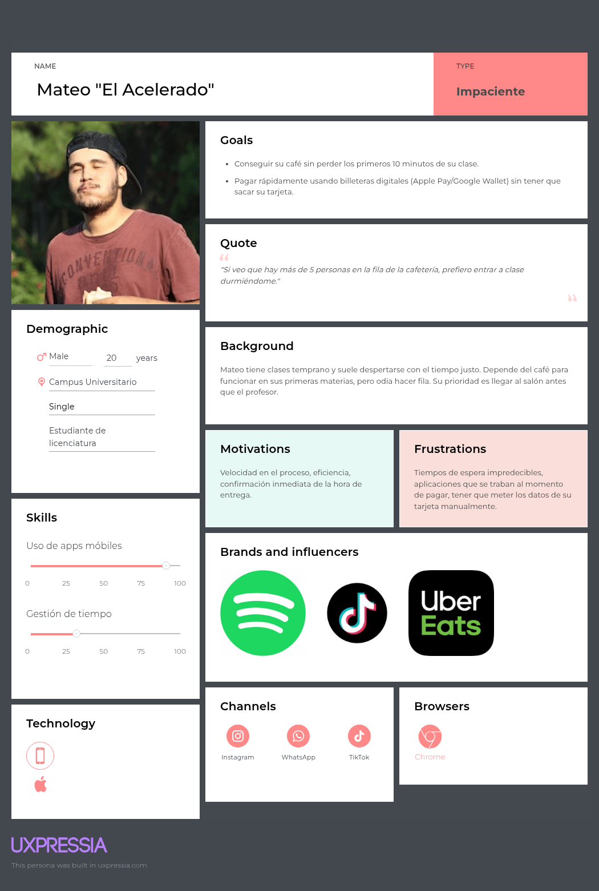
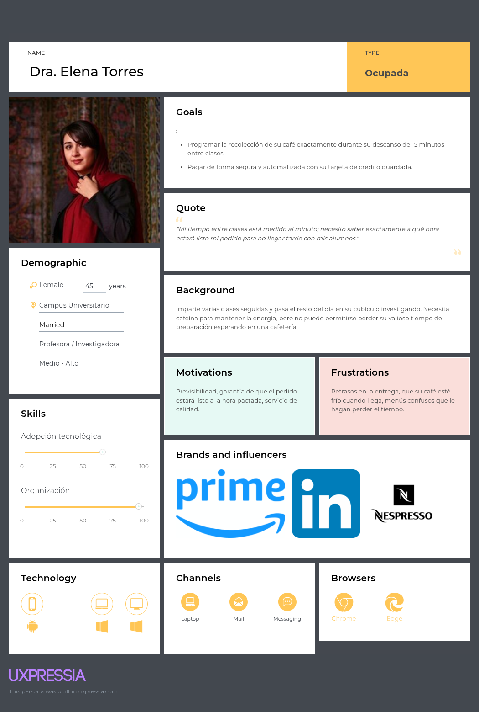
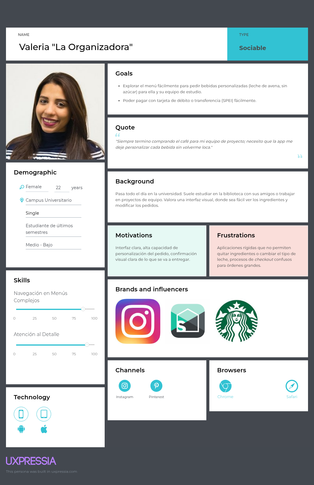
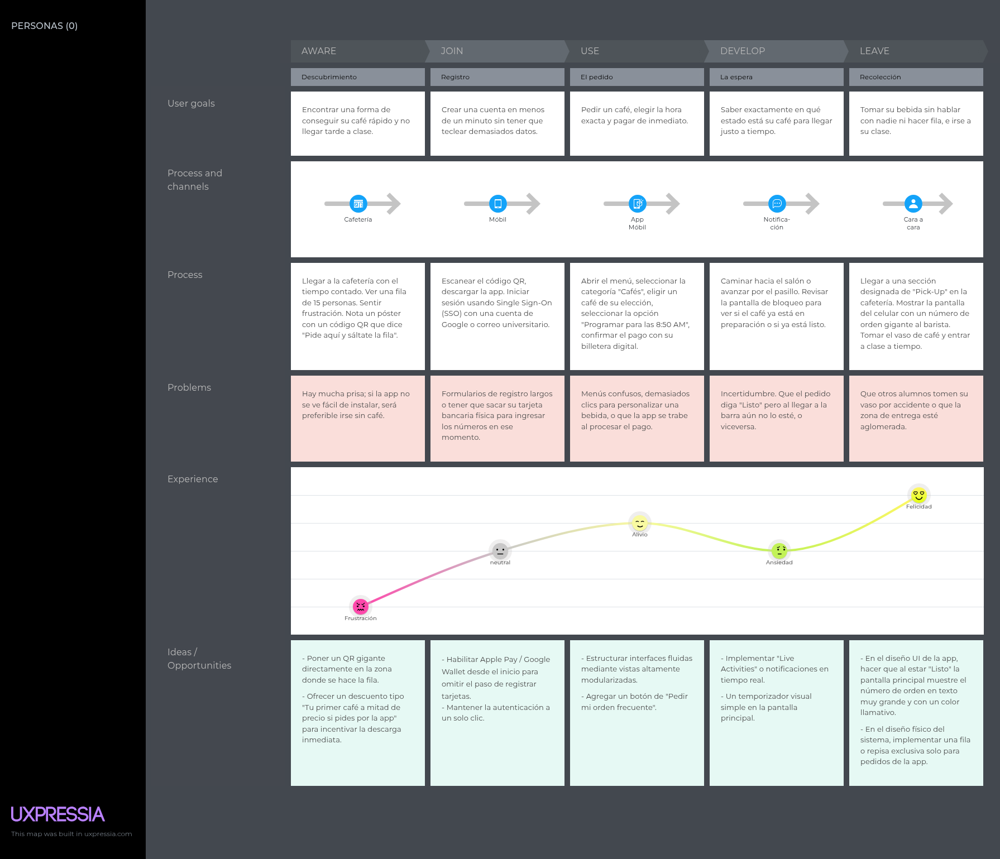
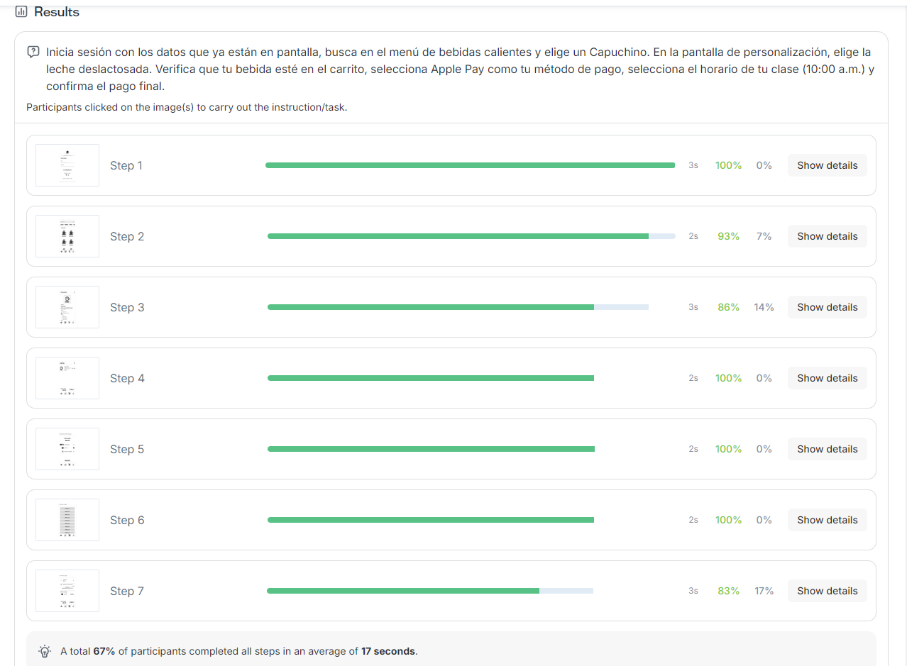
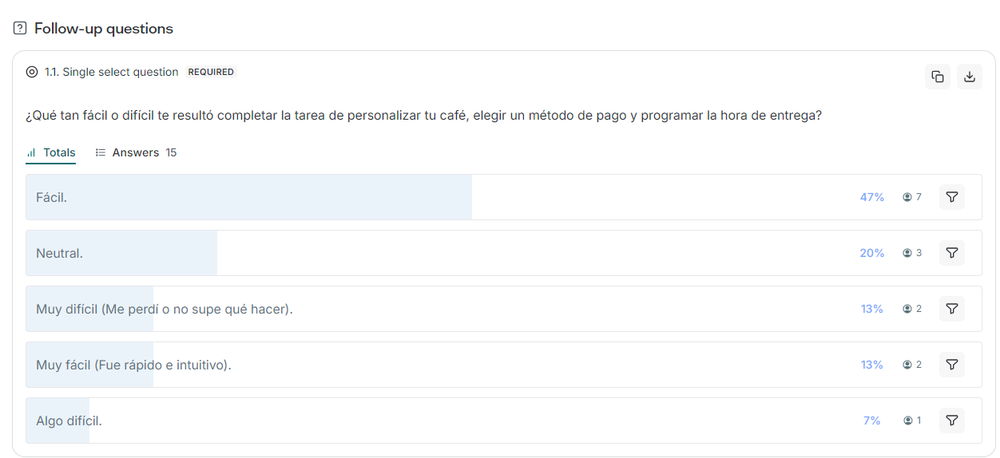
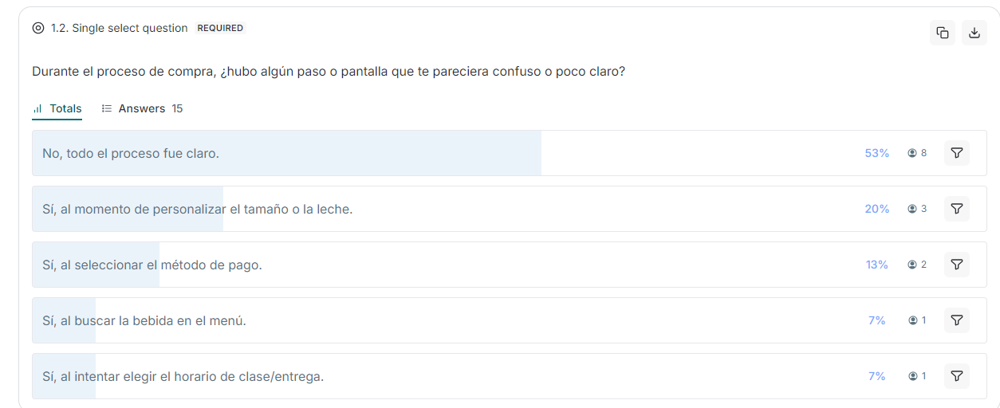
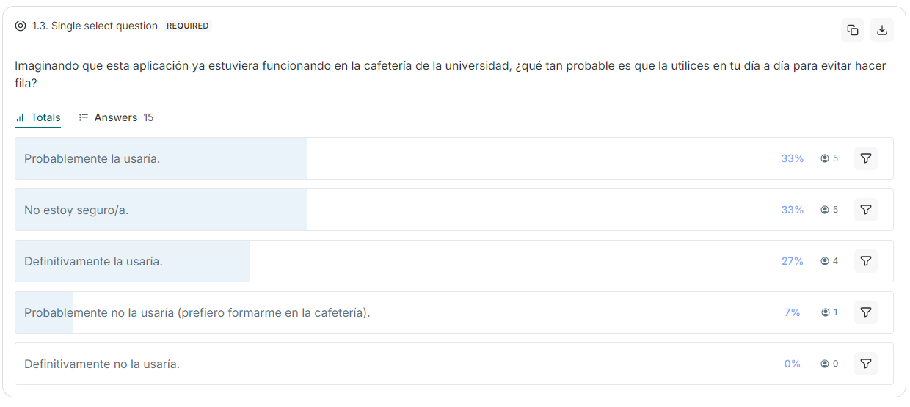

# Proyecto Final: App de Cafetería Estudiantil

**Materia:** Análisis y Diseño de Sistemas de Información (COM-12102-001)

**Equipo PAID**

**Integrantes:**
* Pablo Ernesto Gómez Ignorosa (211643)
* Ana Sofía Ceballos Martínez (212560)
* Ismael Cabrera Arroyo (217632)
* Dulce

---

## Contexto del Proyecto
Construcción de una aplicación móvil en donde los estudiantes puedan programar pedidos de café antes de entrar a clase para optimizar su tiempo. La aplicación incluye:
* Manera intuitiva de seleccionar el menú.
* Sistema para elegir y personalizar un pedido.
* Múltiples opciones de pago integradas (Tarjeta Bancaria (Debito o Credito), Apple Pay, Efectivo).
* Proceso claro para confirmar la hora exacta de entrega.

---

## Entregables

### 1. Personas

Para entender las necesidades y motivaciones de nuestros usuarios, desarrollamos 3 perfiles principales.

### Persona 1: El estudiante acelerado
Representa a nuestro usuario principal, enfocado en la velocidad y la eficiencia.

### Persona 2: La profesora con agenda llena
Representa al personal académico que valora la previsibilidad y la puntualidad extrema.

### Persona 3: La estudiante organizadora
Representa al usuario que realiza pedidos múltiples o altamente personalizados para equipos de trabajo.

---

### 2. Customer Journey

Trazamos el recorrido de nuestro usuario para identificar los *touchpoints*, sus emociones durante el proceso y las oportunidades de mejora en cada fase.

---

### 3. Prototipo a Papel

---

### 4. Pruebas del Prototipo a Papel
*(3 pruebas iniciales)*

---

## 5. Reflexión sobre los Hallazgos y Cambios a Realizar

### De Prototipo a Papel a Prototipo de Medio Nivel

En el primer prototipo a papel, la aplicación incluía una pantalla de ubicación para que el usuario pudiera elegir la sucursal donde recogería su café. Sin embargo, durante la revisión, notamos que agregar un mapa no era tan viable para el usuario ni para el alcance del proyecto, ya que podía hacer el proceso más largo y confuso.

Como el objetivo principal de la aplicación es que el estudiante pueda pedir su café de forma rápida antes de entrar a clase, decidimos eliminar la selección de sucursal y dejar una ubicación fija. Con este cambio, el usuario puede avanzar más rápido hacia la selección del horario y el pago.

También identificamos que el menú necesitaba ser más claro para que el usuario pudiera reconocer las bebidas con facilidad. Por eso, en el prototipo de medio nivel se mejoró la organización del menú y del proceso de pedido, buscando que la navegación fuera más directa.

Otro cambio importante fue agregar más formas de pago. En el prototipo inicial el proceso de pago era más limitado, por lo que se integraron diferentes opciones como tarjeta de débito, tarjeta de crédito, Apple Pay y efectivo. Esto permite que el usuario tenga más alternativas al momento de finalizar su pedido.

En conclusión, los cambios del prototipo a papel al prototipo de medio nivel se enfocaron en simplificar y eliminar elementos poco necesarios y mejorar la claridad de las funciones principales: elegir una bebida, seleccionar un horario y pagar.

---

### 6. Prototipo a Medio Nivel
En esta etapa construimos un *wireframe* interactivo en escala de grises para validar la arquitectura de la información, el flujo de navegación y la usabilidad estructural antes de invertir tiempo en el diseño visual.

(Preferible en telefono)
* **Prototipo (Diseño en Figma):** [Ver archivo de Figma](https://www.figma.com/design/s6R7mhIO14TVrg9y1aNgOc/Cafeteria-Medio-Nivel?node-id=0-1&t=NneSjFBnyN4NlNiw-1)
* **Prueba Digital (Prototipo Interactivo):** [Probar prototipo de medio nivel](https://www.figma.com/proto/s6R7mhIO14TVrg9y1aNgOc/Cafeteria-Medio-Nivel?node-id=0-1&t=NneSjFBnyN4NlNiw-1)

---

### 7. Pruebas de usuario en Lyssna

Para validar la intuición de la navegación realizamos un *Navigation Test* interactivo utilizando **Lyssna**. 

A los usuarios se les asignó la tarea de: Iniciar sesión, personalizar un Capuchino, revisar el carrito, pagar con Apple Pay y programar su horario de recolección.

**[Enlace a la prueba interactiva en Lyssna](https://app.lyssna.com/do/ztfe4nkszj1y/z6za6z)**

### Resultados de la Prueba

A continuación se presentan las métricas obtenidas de las interacciones de los usuarios durante la prueba:

---

## 8. Reflexión sobre los Hallazgos y Cambios a Realizar

### De Prototipo de Medio Nivel a Prototipo de Alto Nivel

El objetivo de la prueba del prototipo de medio nivel fue validar la fluidez del flujo principal de la aplicación: seleccionar un café, personalizarlo, elegir un horario de entrega y realizar el pago. La intención era comprobar que el proceso completo se sintiera rápido y claro para el usuario, ya que la promesa de valor de la aplicación es permitir que los estudiantes pidan su café antes de entrar a clase.

### Hallazgos principales

Durante la prueba digital del prototipo de medio nivel, se identificaron tres áreas de oportunidad principales.

Primero, se observó fricción cognitiva en el menú. Al tener las bebidas representadas con cuadros grises o elementos visuales poco detallados, los usuarios tardaban más en identificar la bebida que querían pedir. En una aplicación pensada para estudiantes con prisa, depender demasiado de la lectura hacía que el proceso se sintiera menos ágil.

Segundo, se detectó que la pantalla de métodos de pago podía ser más clara. En el prototipo de medio nivel, las opciones dependían principalmente del texto, por lo que el usuario tenía que leer cada opción con cuidado antes de seleccionar una. Esto podía generar retrasos justo en una de las partes más importantes del flujo: el pago.

Tercero, se encontró incertidumbre después de confirmar el pedido. La pantalla final no comunicaba con suficiente claridad el estado real de la orden, por lo que el usuario podía quedarse con dudas sobre si el café ya había sido recibido, si estaba en preparación o si ya estaba listo para recoger.

### Cambios implementados en el prototipo de alto nivel

Con base en estos hallazgos, el prototipo evolucionó hacia una versión de alto nivel con mayor claridad visual y una navegación más directa.

Se agregaron ilustraciones a color para representar las bebidas del menú. Esto permite que el usuario identifique más rápido el producto que desea pedir, sin depender únicamente del texto. Por ejemplo, en la pantalla de producto se muestra la bebida seleccionada, su precio, descripción y opciones de personalización como tamaño y tipo de leche.

También se mejoró la pantalla de pago al incluir elementos visuales para los métodos disponibles. En la pantalla de “Total a pagar” se muestran opciones como débito, crédito, Apple Pay y efectivo, acompañadas de sus respectivos íconos. Esto facilita que el usuario reconozca cada método de pago de manera más rápida.

Además, se rediseñó la pantalla de seguimiento de la orden. En lugar de mostrar únicamente una confirmación estática, se agregó una barra de progreso con tres estados: **Recibido**, **Preparando** y **En barra**. También se muestra la hora elegida y la hora estimada en la que el café estará listo. Esto ayuda a disminuir la incertidumbre del usuario después de realizar el pedido.

En conclusión, los cambios del prototipo de medio nivel al prototipo de alto nivel se enfocaron en mejorar la experiencia visual, reducir el esfuerzo del usuario y hacer que el flujo de pedido fuera más rápido, claro y confiable.

---

### 9. Prototipo a Alto Nivel
Versión final de la aplicación con diseño visual completo, tipografías, paleta de colores, microinteracciones y los ajustes de usabilidad aplicados tras las pruebas de usuario.

(Preferible en telefono)
* **Prototipo (Diseño en Figma):** [Ver archivo de Figma](https://www.figma.com/design/FpGEyCkSmcWek0Cf3JsSiY/Cafeteria-Alto-Nivel?node-id=0-1&t=U9VXwjtCamA71Exd-1)
* **Prueba Digital (Prototipo Interactivo):** [Probar prototipo final](https://www.figma.com/proto/FpGEyCkSmcWek0Cf3JsSiY/Cafeteria-Alto-Nivel?node-id=0-1&t=U9VXwjtCamA71Exd-1)

---

## Backlog del Proyecto
Backlog de la planeación, asignación de tareas y el progreso general de nuestro equipo durante el desarrollo de la aplicación:

* [Ver Backlog](https://github.com/users/mayelmais/projects/1/views/1)

---

## User Stories

## Criterios de complejidad

* **1:** Cambio mínimo
* **3:** Interfaz/frontend
* **5:** Mostrar datos o cálculo simple
* **7:** Base de datos y lógica básica
* **10:** Funcionalidad completa con formulario
* **15:** Nueva interfaz y base de datos
* **21:** Varias opciones con lógica compleja
* **30:** Integración de APIs externas

| Usuario               | User Story                                                                                                                                            | Complejidad | Prioridad |
| --------------------- | ----------------------------------------------------------------------------------------------------------------------------------------------------- | ----------: | --------- |
| Estudiante: Dulce     | Como estudiante, quiero consultar el menú de bebidas disponibles, para elegir fácilmente qué café pedir antes de entrar a clase.                      |           5 | Alta      |
| Estudiante: Rafael    | Como estudiante, quiero personalizar mi bebida con opciones como tamaño, tipo de leche y azúcar, para pedirla de acuerdo con mis gustos.              |          21 | Alta      |
| Estudiante: Sara      | Como estudiante, quiero elegir la hora exacta de entrega de mi café, para recogerlo antes de entrar a clase.                                          |          10 | Alta      |
| Estudiante: Diego     | Como estudiante, quiero ver el tiempo estimado de preparación, para saber cuándo ir por mi café.                                                      |           5 | Alta      |
| Estudiante: Iñaki     | Como estudiante, quiero pagar con tarjeta de débito, para no tener que usar efectivo.                                                                 |          30 | Alta      |
| Estudiante: Raúl      | Como estudiante, quiero pagar con tarjeta de crédito, para tener otra opción de pago dentro de la aplicación.                                         |          30 | Alta      |
| Estudiante: Alejandro | Como estudiante, quiero seleccionar pago en efectivo, para poder pagar al recoger mi pedido.                                                          |           7 | Media     |
| Estudiante: Mónica    | Como estudiante, quiero crear una cuenta, para identificarme dentro de la aplicación.                                                                 |          10 | Alta      |
| Estudiante: Tomás     | Como estudiante, quiero iniciar sesión, para acceder a mis pedidos y guardar mi información.                                                          |           7 | Alta      |
| Estudiante: Leo       | Como estudiante, quiero guardar mis pedidos favoritos, para repetirlos rápidamente.                                                                   |           7 | Media     |
| Estudiante: Sandra    | Como estudiante, quiero recibir promociones y descuentos, para gastar menos dinero en mis compras.                                                    |           3 | Baja      |
| Estudiante: Nelly     | Como estudiante, quiero ver el estado de mi orden, para saber si mi café fue recibido, está en preparación o ya está listo.                           |          15 | Alta      |
| Estudiante: Fátima    | Como usuario, quiero revisar el resumen de mi pedido antes de confirmar, para verificar la bebida, personalización, hora de entrega y método de pago. |           5 | Alta      |

